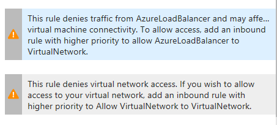

# Azure Service Fabric cluster with Load Balancer Standard (Internal and Public)

If you were trying to run Azure Service Fabric with Load Balancer Standard, you might have noticed, that your Service Fabric cluster was not capable to setup correctly. This issue appears, if you only change tier of Load Balancer in ARM template. In such case, if you connect remotely to one of the nodes, you can see that Service Fabric Agent service is trying to connect to remote location to download bits necessary to setup and run Service Fabric cluster, but it is unsuccessful and emits following error and few more:

```
Failed to process adhoc repair response: System.Exception: System.Net.WebException: Unable to connect to the remote server ---> System.Net.Sockets.SocketException: A connection attempt failed because the connected party did not properly respond after a period of time, or established connection failed because connected host has failed to respond 52.174.163.204:443

   at System.Net.Sockets.Socket.DoConnect(EndPoint endPointSnapshot, SocketAddress socketAddress)
   at System.Net.ServicePoint.ConnectSocketInternal(Boolean connectFailure, Socket s4, Socket s6, Socket& socket, IPAddress& address, ConnectSocketState state, IAsyncResult asyncResult, Exception& exception)
   --- End of inner exception stack trace ---
   at System.Net.HttpWebRequest.GetRequestStream(TransportContext& context)
   at System.Net.HttpWebRequest.GetRequestStream()
   at Microsoft.Azure.ServiceFabric.Extension.Core.RestClient.Invoke(Uri requestUri, String method, String requestBody, X509Certificate2 clientCertificate)
   at Microsoft.Azure.ServiceFabric.Extension.Core.RestClient.Invoke(Uri requestUri, String method, String requestBody, List`1 clientCertificates)

   at Microsoft.Azure.ServiceFabric.Extension.Core.RestClient.Invoke(Uri requestUri, String method, String requestBody, List`1 clientCertificates)
   at Microsoft.Azure.ServiceFabric.Extension.Core.WrpTopologyService.GetAdHocRepairPollResponse(String machineName, VmExtensionAdHocRepairPollRequest request)
   at Microsoft.Azure.ServiceFabric.Extension.Core.RepairStrategy.AdHocRepairHandler.PollSFRPForRepair()
```

This is caused due to the fact, that Service Fabric agent tries to connect to Download Software Center (DSC) and Service Fabric Resource Provider services, but it fails to. Why? Simpel answer: because from networking perspective Standard Load Balancer works in different way than its basic tier.

### Load Balancer Standard integration with VNET

I have borrowed following lines form [Standard Load Balancer documentation](https://docs.microsoft.com/en-us/azure/load-balancer/load-balancer-standard-overview): *"Standard Load Balancer is fully onboarded to the virtual network.  The  virtual network is a private, closed network.  Because Standard Load  Balancers and Standard public IP addresses are designed to allow this  virtual network to be accessed from outside of the virtual network,  these resources now default to closed unless you open them. This means  Network Security Groups (NSGs) are now used to explicitly permit and  whitelist allowed traffic.  You can create your entire virtual data  center and decide through NSG what and when it should be available.  If  you do not have an NSG on a subnet or NIC of your virtual machine  resource, traffic is not allowed to reach this resource."*

And when it comes to outbound communication:

*"Load-balanced VM without an Instance Level Public IP address* 

*In this scenario, the VM is part of a public Load Balancer backend pool. The VM does not have a public IP address assigned to it. The Load Balancer resource must be configured with a load balancer rule to create a link between the public IP frontend with the backend pool."*

Simply put, machines behind the Load Balancer Standard are not capable of any outbound communication until it is explicitly allowed thru creation of Load Balancing rules and this is the reason, why Service Fabric Agent is not able to download the bits needed to setup the cluster. Further in the text we describe what settings are needed to be performed in order to allow **Service Fabric Cluster with Internal Standard Load Balancer to setup correctly**. As this involves need of introduction of Public Standard Load Balancer, provided instruction are relevant also for case, where you would use only Public Standard LB.

### Deploy Azure Service Fabric with Internal Standard Load Balancer

As introduction of Standard Load Balancer by default blocks all the outbound communication, we need to allow it. In case we use only **Internal Standard Load Balancer**, there is no way how to allow our Virtual Machine Scale Set, where Service Fabric should be deployed, to communicate with outside world. To have this option, we can either assign Public IP Address to every node in VMSS (what is not the best solution) or to introduce second Standard Load Balancer, public one. As stated, Service Fabric Agent service needs to communicate with Download Software Center (DSC) and Service Fabric Resource Provider services. Addresses of these services are hard coded in Service Fabric product in CNAME form and their IP Address can be changed, that means, we need to allow all outbound communication on port 443. To achieve that, we need to create load balancing rule on Public Load Balancer for port 443. Moreover to follow the rule of alowing only necessary communication, we should introduce also Network Security Group (NSG) for Service Fabric subnet. By default NSG allows all the intra VNET communication (communication between machines) and as well all communication flowing thru Load Balancer to or from VNET. These default rules cannot be changed, but can be overriden by introduction of new rules with higher priorities. As creation of load balancing rule on port 443 allows also inbound communication, we need to deny it, thru introduction of deny inbound rule for port 443 on NSG. This will lead to following warnings displayed in Azure portal on eny port 443 rule of NSG, which you can ignore.




Within this repository there are two ARM templates enclosed. **VirtualNetwork.json** template contains networking resources - Virtual Network, Virtual Network Gateway, Public IP Adress for Gateway and Network Security Group with inbound deny rule for port 443 configured. Before you deploy these resources, you need to generate your [own certificate for Point To Site connection](https://docs.microsoft.com/en-us/azure/vpn-gateway/vpn-gateway-certificates-point-to-site) in order to be capable to communicate with Service Fabric Cluster securely within the VNET later on using Point to Site connection. 

Service Fabric cluster can be deployed to created Virtual Network using **ServiceFabricCluster.json** ARM template.  Besides Service Fabric related resources, it contains also Standard Load Balancers public and internal one, while public one has only one Load balancing rule, that allows communication on port 443. 

Allowing outbound communication on port 443 is the exception you need to allow from networking perspective to achieve correct deployment of Azure Service Fabric with LB Standard. How to proceed in case you do not want expose your virtual network to outer world as it might be security concern for you? 

### How to proceed if I can not allow any outbound communication?

In case you can not allow any outbound communication and you do not want to introduce Public Load Balancer, your only option as of now, is to perform standalone deployments of Service Fabric bits to Virtual Machine Scale set nodes. This can be achieved thru Desired State Configuration. As I have not performed this deployment yet, let me at least share useful documentation, where there is described standalone deployment (https://docs.microsoft.com/en-us/azure/service-fabric/service-fabric-cluster-creation-for-windows-server). In near future my plans are to explore this possibility and once I walk thru this path, I will share DSC files for deployment of Service Fabric bits to VMSS. 


